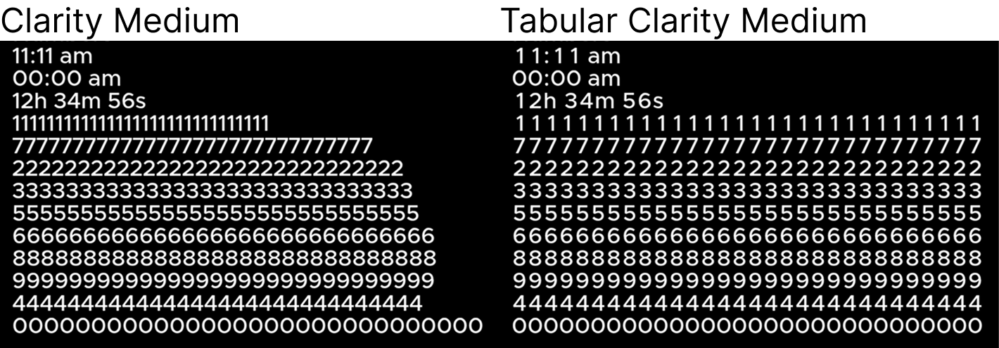

# Clarity City Tabular

Clarity City is an open source sans-serif typeface.

The Tabular variant simply means digits are monospaced, for use in tables (for example).

## License

Licensed under Open Font License (OFL). See [LICENSE](./LICENSE).

### Attribution

Clarity City is based upon the work done by @chrismsimpson on [Metropolis](https://github.com/chrismsimpson/Metropolis).
